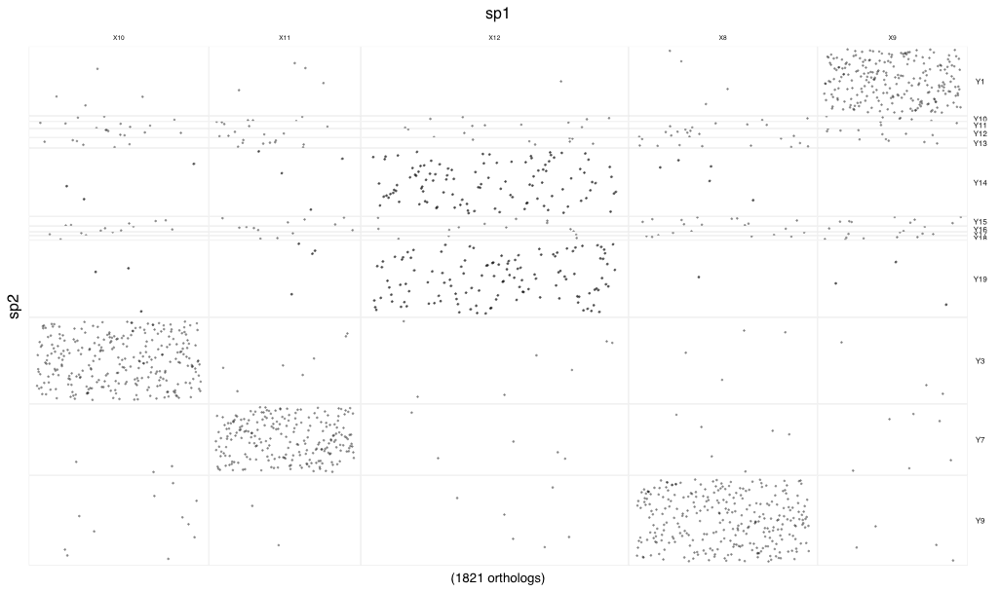
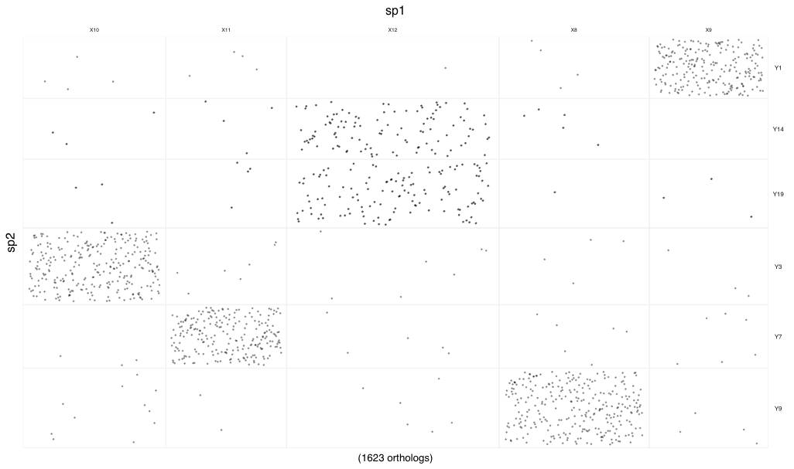
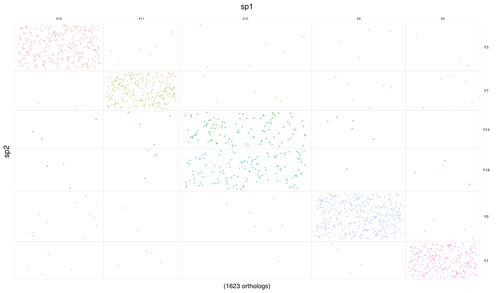
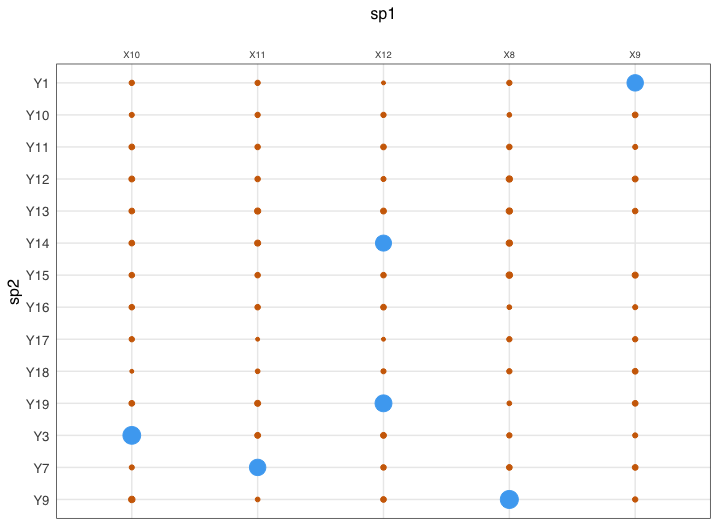
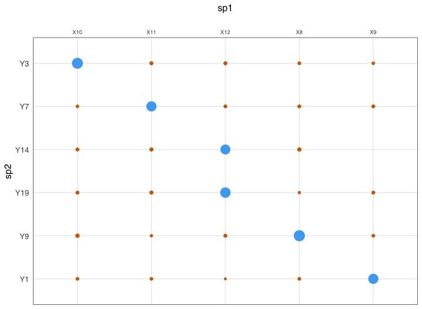

# macrosyntR

[](https://www.gnu.org/licenses/gpl-3.0)

An R package to plot oxford grided plots, and results of one-tailed fischer test
in order to investigate the chromosomal evolution of whole assembled genomes.
This package won't calculate the orthologs from the sequences. Make sure to first create a table of mutual best hits (linux users can use my shellscript [mbhXpress](https://github.com/SamiLhll/mbhXpress))

-----------------------------------------------------------------------   

# Install

You can install this package by entering the following within R:

```{r}

devtools::install_github("SamiLhll/macroSyntR")

```

# Dependencies

This package was implemented under R version = 4.1.0
It imports the following R packages :   

- stats
- utils
- dplyr  
- ggplot2   
- ggthemes   
- tidyr
- reshape2

# Usage

You need to calculate the orthologs between two species before considering generating any plot with this package.
For this I use a shell script that I released and that calculates the mutual best hits from two fasta files (peptides). It uses diamond blast so usually it doesn't take more than 2 minutes to run (on a proper computer) :
[mbhXpress](https://github.com/SamiLhll/mbhXpress)
When it's done you have a table with two columns, each corresponding to a species. On each row you'll have the protein IDs of two mutual best hits. 

### load MBH table into R :

The first step is to load the mutual best hit table (created with the [generate_MBH_table](https://github.com/SamiLhll/GenomicUtils/blob/a8803782f64c7ff31f0723d9e11f8f7d1a57e907/MacroSynteny/Generate_blastp_MBH) bashscript) along with the genomic coordinates of the genes coding for the proteins on their respective species in BED format.

```{r}

# most basic usage :
orthologs <- load_MBH_table("inst/extdata/sp1_vs_sp2.tab","sp1.bed","sp2.bed")
head(orthologs)

```

This command above gives the following output :


|   |sp2_pep | sp1_pep | sp1_chr | sp1_start | sp1_stop | sp2_chr | sp2_start | sp2_stop | sp1_index | sp2_index |
|---|--------|---------|---------|-----------|----------|---------|-----------|----------|-----------|-----------|
| 1 |Y1.13.p1|  T15550 |     X9  |37370904   |37389905  |    Y1   |  94074    |98562     | 1780      |   1       |
| 2 |Y1.15.p1|  T15167 |     X9  |21098862   |21127221  |    Y1   | 100166    |108471    |  1679     |    2      |
| 3 |Y1.17.p1|  T14952 |     X9  |13460779   |13475763  |    Y1   | 113555    |116613    |  1623     |    3      |
| 4 |Y1.18.p1|  T15515 |     X9  |36170511   |36209562  |    Y1   | 116920    |146404    |  1766     |    4      |
| 5 |Y1.21.p1|  T15485 |     X9  |34971016   |35007104  |    Y1   | 154209    |168520    |  1757     |    5      |
| 6 |Y1.23.p1|  T15212 |     X9  |23300128   |23313252  |    Y1   | 170863    |175425    |  1696     |    6      |

### Plot the oxford grided plot :

```{r}
# most basic usage :
plot_synteny_oxfod_grid(orthologs,sp1_name="sp1",
                                  sp2_name="sp2")

```




```{r}
# filter to keep only the meaningfull associations using the sp2_keep_chr_names argument :

plot_synteny_oxford_grid(orthologs,sp1_name = "sp1",
                                   sp2_name = "sp2",
                                   sp2_keep_chr_names = c("Y1","Y3","Y7","Y9","Y14","Y19"))

```




```{r}

# Play with other rendering arguments to 
# reorder the chromosomes using the sp2_chr_order, 
# add some colors by setting the colors argument to TRUE
# or change the size of the dots : 

plot_synteny_oxford_grid(orthologs,sp1_name = "sp1",
                                   sp2_name = "sp2",
                                   sp2_keep_chr_names = c("Y1","Y3","Y7","Y9","Y14","Y19"),
                                   colors =TRUE,
                                   sp2_chr_order = c("Y3","Y7","Y14","Y19","Y9","Y1"),
                                   dot_size = 0.6)

```



### Calculate contingency table and plot result of fischer test :

```{r}

# calculate contingency table :

contingency_table <- calculate_contingency_table(orthologs)

# most basic usage of plotting function :
plot_fischer_test(contingency_table,sp1_name = "sp1",
                                    sp2_name = "sp2)

```


```{r}
# use arguments to filter and reorder the chromosomes on the plot :
plot_fischer_test(contingency_table,sp1_name = "sp1",
                                    sp2_name = "sp2,
                                    sp2_keep_chr_names = c("Y3","Y7","Y14","Y19","Y9","Y1"),
                                    sp2_chr_order = c("Y3","Y7","Y14","Y19","Y9","Y1"))

```


