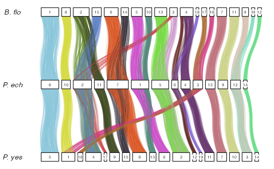

```{r, include = FALSE}
knitr::opts_chunk$set(
  collapse = TRUE,
  comment = "#>"
)
```


An R package for evaluation of pair-wise synteny conservation at the genome-wide scale. It takes a table of orthologs and genome annotation files formatted as BED to automatically infer significantly conserved linkage groups, and order them on an oxford grid.

# Overview :

It has 7 functions :   


|     Function          |         description                                                                                          | 
|-----------------------|--------------------------------------------------------------------------------------------------------------|
| load_orthologs()         | integrates genomic coordinates (bedfiles) of the orthologs of the species to compare                     |
| compute_macrosynteny() | compares all the chromosomes to each other and identifies the significantly conserved linkage groups   |
| reorder_macrosynteny()     | takes an orthologs_df (from load_orthologs()) and outputs an orthologs_df with chromosome levels reordered by cluster and amount of orthologs (run alone or by setting plot_oxford_grid(...,auto_order_clusters = TRUE) )|
| plot_macrosynteny()      | draws a dotplot displaying the significant linkage groups with their relative amount of orthologs      |
| plot_oxford_grid()    | draws an Oxford grid from an orthologs_df (output of either load_orthologs() or reorder_macrosynteny()                  |    
| reverse_species_order() | returns an orthologs_df where sp1 became sp2 and the other way around |
| get_syntenic_genes() | compute all blocks containing at least two consecutive genes (relative order) in both species and returns the details as a table |
| reorder_multiple_macrosyntenies() | takes an orthologs_df and reorder like reorder_macrosynteny() but for more than two species |
| plot_chord_diagram() | takes an orthologs_df with two or more species and draws the orthologs as lines in a chord diagram |
| compute_linkage_groups() | takes an orthologs_df and computes the conserved linkage groups |

# Step-by-step tutorial :

We demonstrate the usage of the package using a subset of publicly available data (samples attached to the package).   

* Branchiostoma floridae (Simakov et al. 2020)   

* Patinopecten yessoensis (Wang et al. 2017)

* Paraescarpia echinospica (Sun et al. 2021)   


### 1 - Pre-processing :

#### 1.1 - Foreword :

This package doesn't compute the orthologs. I recommend to compute pairwise orthology as reciprocal best hits using [rbhxpress](https://github.com/SamiLhll/rbhXpress). It is fast and accurate as it uses diamond blast.

To use more than 2 species, I recommend using OrthoFinder (Emms and Kelly 2019) as it's easy to derive single copy orthologs from it's output.

Drawing the plots using this package require to have the following data :   

* A two (or more) columns table of orthologs (reciprocal best hits). Each gene must appear only once in the table.   
* genomic coordinates on each species for all the orthologs

let's say I have the following orthologs :  

```{bash, eval = FALSE}
sp1.gene.x1  sp2.gene.y1   
sp1.gene.X2  sp2.gene.y2   
...   
sp1.gene.xn  sp2.gene.yn   
```

then, the genomic coordinates files must look like (BED format) :   

* species1 :
```{bash, eval = FALSE}
chr4    200    600    sp1.gene.x1   
chr8     10    400    sp1.gene.x2   
...   
chr12   900    980    sp1.gene.xn   
```

* species2 :
```{bash, eval = FALSE}
chr1    100    200    sp2.gene.y1   
chr6     50    200    sp2.gene.y2   
...   
chr8   300    480    sp2.gene.yn   
```


#### 1.2 - Example using two species (rbhXpress) :

I'm going to show usage of this package by comparing the data of the lancelet Branchiostoma floridae ([Simakov et al. 2020](https://doi.org/10.1038/s41559-020-1156-z)) with the data of the vestimentifera (giant tubeworm) Paraescarpia echinospica ([Sun et al. 2021](https://doi.org/10.1093/molbev/msab203)).      

Download the sequences of proteins (fasta format) and their genomic coordinates :    

 - B.floridae : 
 The data are available on ncbi at https://www.ncbi.nlm.nih.gov/genome/?term=txid7739   
 get the protein sequences at  by clicking the "Download sequences in FASTA format for protein".   
 get the genomic coordinates by clicking "Download genome annotation in tabular format" and further click download as csv.   
 
 - P.echinospica :   
 The data are available on figshare under the doi : [10.6084/m9.figshare.15050478](https://doi.org/10.6084/m9.figshare.15050478) 
 
 
 Compute the reciprocal best hits of the fasta sequences. Using [rbhXpress](https://github.com/SamiLhll/rbhXpress) you can achieve it by typing the following in your terminal :   
 
```{bash,eval = FALSE}
 # In the terminal :
 # call rbhXpress with using 6 threads :
 bash rbhXpress -a GCF_000003815.2_Bfl_VNyyK_protein.faa -b Pec_ragoo_v1.0.pep.fasta -o Bflo_vs_Pech.tab -t 6
 
```
 
To convert the genome annotation to the [bed file format](https://www.ensembl.org/info/website/upload/bed.html), I'm using the following command lines (if unfamiliar with this you can use a spreadsheet software). The concept is to keep the chrom, chromStart, chromEnd mandatory fields plus the name optional field that links the genomic region with the protein product :   
 
```{bash, eval = FALSE}
 # In the terminal :
 # B.floridae CSV file to bed
tail -n +2 proteins_75_971579.csv | cut -d "," -f1,3,4,9  | \
sed -e 's/\"//g' -e 's/,/\t/g' -e 's/chromosome /BFL/g' > Bflo.bed

 # P.echinospica gff file to bed
fgrep "gene" Pec_genes.ragoo_v1.0.gff | cut -f1,4,5,9 | cut -d ";" -f 1 | \
fgrep "Superscaffold" | sed -e 's/ID=//g' -e 's/Superscaffold/PEC/g' > Pech.bed

```

**Please note that  the example dataset attached to this package is a subset. I kept only 2500 ortholog pairs to lower the compilation time**.

#### 1.3 - Example using 3 species (Orthofinder) :

If we wanted to add one species to the previous study, we would need to get the data and compute the single copy orthologs.   
We will use here the data for the scallop Patinopecten yessoensis ([Wang et al. 2017](https://doi.org/10.1038/s41559-017-0120)).
These data were shared by the authors upon request and a sample is attached with the package.

The first step is to compute the orthologs using orthofinder (Emms and Kelly 2019).   
When done, you can extract the Single copy orthologs using the following command line :

```{bash, eval = FALSE}

fgrep -f <path_to_your_orthofinder_run>/Orthogroups/Orthogroups_SingleCopyOrthologues.txt \
<path_to_your_orthofinder_run>/Orthogroups/Orthogroups.tsv > Single_copy_orthologs.tab

```

One important thing about orthofinder's output is the encoding that will create issues when loaded in R.

If for the encoding you have like me :

```{bash, eval = FALSE}

file Single_copy_orthologs.tab
# ASCII text, with CRLF line terminators

```

These CRLF line terminators are a problem and you should replace it by regular "\n" as line terminator.   
It can be achieved using the following command :

```{bash, eval = FALSE}

tr  '\015\012/' '\n' < Single_copy_orthologs.tab | awk '($0 != "") {print}' > Single_copy_orthologs.tsv

```

### 2 - Load the data :

Now the data are ready to be loaded into R using macrosyntR :

```{r setup}
library(macrosyntR)
```

```{r}

my_orthologs_table <- load_orthologs(orthologs_table = system.file("extdata","Bflo_vs_Pech.tab",package="macrosyntR"),
                                     bedfiles = c(system.file("extdata","Bflo.bed",package="macrosyntR"),
                                     system.file("extdata","Pech.bed",package="macrosyntR")))

head(my_orthologs_table)

```

or alternatively : 

```{r}

my_orthologs_with_3_sp <- load_orthologs(orthologs_table = system.file("extdata","Single_copy_orthologs.tsv",package="macrosyntR"),
                                     bedfiles = c(system.file("extdata","Bflo.bed",package="macrosyntR"),
                                                  system.file("extdata","Pech.bed",package="macrosyntR"),
                                                  system.file("extdata","Pyes.bed",package="macrosyntR")))

head(my_orthologs_with_3_sp)

```


### 3 - Compute linkage groups :

Let's vizualize the pairs of chromosomes that have a significant amount of orthologs using compute_macrosynteny().
We can visualize the results on a dot plot using plot_macrosnyteny() and see the distributions of orthologs on an oxford grid using plot_oxford_grid()

```{r}

# compute significance :
macrosynteny_df <- compute_macrosynteny(my_orthologs_table)
head(macrosynteny_df)

```


```{r,eval = FALSE, out.width = '450px'}

# visualize the loaded data on a oxford grid :
plot_oxford_grid(my_orthologs_table,
                 sp1_label = "B.floridae",
                 sp2_label = "P.echinospica")

# Visualize the results of the test of significance :
plot_macrosynteny(macrosynteny_df,
                  sp1_label = "B.floridae",
                  sp2_label = "P.echinospica")

```

```{r,echo = FALSE,out.width = c('300px','300px')}

# visualize the loaded data on a oxford grid :
plot_oxford_grid(my_orthologs_table,
                 sp1_label = "B.floridae",
                 sp2_label = "P.echinospica")

# Visualize the results of the test of significance :
plot_macrosynteny(macrosynteny_df,
                  sp1_label = "B.floridae",
                  sp2_label = "P.echinospica")

```


To get these (sub)chromosomal associations of two or more species, we can use the function compute_linkage_groups()

```{r,eval = FALSE}
my_linkage_groups <- compute_linkage_groups(my_orthologs_with_3_sp)
head(my_linkage_groups)

```


```{r,echo = FALSE}

my_linkage_groups <- compute_linkage_groups(my_orthologs_with_3_sp)
head(my_linkage_groups)

```

### 4 - Reorder chromosome levels to group the linkage groups in clusters :

#### 4.1 - Automatic reordering using a network-based greedy algorithm :

Reordering the chromosomes using a network based greedy algorithm can be performed by calling the function reorder_macrosynteny.
It returns an orthologs_df with reordered levels in sp1.Chr and sp2.Chr. These columns are factors where the levels determine the plotting order.
You'll see the results of the clustering, when drawing the oxford grid of this newly generated orthologs data.frame

```{r,eval = FALSE}

# visualize the loaded data on a oxford grid :
my_orthologs_table_reordered <- reorder_macrosynteny(my_orthologs_table)
plot_oxford_grid(my_orthologs_table_reordered,
                 sp1_label = "B.floridae",
                 sp2_label = "P.echinospica")

# compute significance and visualize on a dotplot :
macrosynteny_df_reordered <- compute_macrosynteny(my_orthologs_table_reordered)
plot_macrosynteny(macrosynteny_df_reordered,
                  sp1_label = "B.floridae",
                  sp2_label = "P.echinospica")

```

```{r,echo = FALSE}
# visualize the loaded data on a oxford grid :
my_orthologs_table_reordered <- reorder_macrosynteny(my_orthologs_table)
plot_oxford_grid(my_orthologs_table_reordered,
                 sp1_label = "B.floridae",
                 sp2_label = "P.echinospica")
# compute significance and visualize on a dotplot :
macrosynteny_df_reordered <- compute_macrosynteny(my_orthologs_table_reordered)
plot_macrosynteny(macrosynteny_df_reordered,
                  sp1_label = "B.floridae",
                  sp2_label = "P.echinospica")

```

#### 4.2 - Manually reorder/subset the Chromosomes :

If you would like to subset some chromosomes of interest and manually reorder them you can still take advantage of functions implemented to handle data.frames.
This task is out of the scope of this package, and can achieved using base R :

```{r,eval = FALSE}
# select only the orthologs falling in the chromosomes of interest and plot: 
subset_of_orthologs <- subset(my_orthologs_table, sp1.Chr %in% c("BFL13","BFL15","BFL2","BFL3") & sp2.Chr %in% c("PEC2","PEC5","PEC11"))

plot_oxford_grid(subset_of_orthologs,
                 sp1_label = "B.floridae",
                 sp2_label = "P.echinospica")

# reorder :
subset_of_orthologs$sp2.Chr <- factor(subset_of_orthologs$sp2.Chr,levels = c("PEC5","PEC11","PEC2"))
plot_oxford_grid(subset_of_orthologs,
                 sp1_label = "B.floridae",
                 sp2_label = "P.echinospica")

# Compute and plot macrosynteny :
macrosynteny_of_subset <- compute_macrosynteny(subset_of_orthologs)
plot_macrosynteny(macrosynteny_of_subset,
                 sp1_label = "B.floridae",
                 sp2_label = "P.echinospica")

```

```{r,echo = FALSE,out.width = c('300px','300px')}
# select only the orthologs falling in the chromosomes of interest and plot: 
subset_of_orthologs <- subset(my_orthologs_table, sp1.Chr %in% c("BFL13","BFL15","BFL2","BFL3") & sp2.Chr %in% c("PEC2","PEC5","PEC11"))

plot_oxford_grid(subset_of_orthologs,
                 sp1_label = "B.floridae",
                 sp2_label = "P.echinospica")

# reorder :
subset_of_orthologs$sp2.Chr <- factor(subset_of_orthologs$sp2.Chr,levels = c("PEC5","PEC11","PEC2"))
plot_oxford_grid(subset_of_orthologs,
                 sp1_label = "B.floridae",
                 sp2_label = "P.echinospica")


```


### 5 - Plot directly with reordering the linkage groups and coloring  :

The reordering can be performed on the row when calling plot_oxford_grid() by setting the reorder argument to TRUE.

```{r,eval = FALSE}

# visualize the loaded data on a oxford grid  with reordering and coloring by cluster :
plot_oxford_grid(my_orthologs_table,
                 sp1_label = "B.floridae",
                 sp2_label = "P.echinospica",
                 reorder = TRUE,
                 color_by = "clust")

# redo and color by sp1.Chr instead :
plot_oxford_grid(my_orthologs_table,
                 sp1_label = "B.floridae",
                 sp2_label = "P.echinospica",
                 reorder = TRUE,
                 color_by = "sp1.Chr")

```

```{r,echo = FALSE,out.width = c('300px','300px')}

# visualize the loaded data on a oxford grid  with reordering and coloring by cluster :
plot_oxford_grid(my_orthologs_table,
                 sp1_label = "B.floridae",
                 sp2_label = "P.echinospica",
                 reorder = TRUE,
                 color_by = "clust")

# redo and color by sp2.Chr instead :
plot_oxford_grid(my_orthologs_table,
                 sp1_label = "B.floridae",
                 sp2_label = "P.echinospica",
                 reorder = TRUE,
                 color_by = "sp2.Chr")

```

### 6 - Customize the plots :

Plots returned from both plot_oxford_grid() and plot_macrosynteny() are ggplot objects and it is possible to further customizing them using the vocabulary from the ggplot2 package.

#### 6.1 - customize the legend :

As the functions plot_oxford_grid(), plot_macrosynteny() and plot_chord_diagram() return a ggplot2 object, you can customize the plots using ggplot2::theme() function.
For example, if you want to display the legend on the right of the plot you can do :
```{r}

library(ggplot2)

# legend on right (works also with "top" and "left") :
plot_macrosynteny(macrosynteny_df_reordered) +
  theme(legend.position = "right")

```


#### 6.2 - change the color palette :

plot_oxford_grid() features an option color_palette, but it is also possible to set it using scale_color_manual() from ggplot2 :

```{r}

# Check how many colors are necessary :
print(length(unique(my_orthologs_table_reordered$sp2.Chr)))

# change color_palette using plot_oxford_grid option color_palette :
color_palette_Pechinospica_chromosomes <- c("#A52A2A", "#FFD39B", "#66CDAA", "#8EE5EE", "#7FFF00", "#FFD700", "#FF7F00", "#474747", "#6495ED", "#FF3030", "#0000EE", "#FF1493", "#8A2BE2", "#080808")


plot_oxford_grid(my_orthologs_table_reordered,
                 color_by = "sp2.Chr",
                 color_palette = color_palette_Pechinospica_chromosomes)

```

```{r}

# change the colors in plot_macrosynteny using ggplot2 functions :

plot_macrosynteny(macrosynteny_df_reordered) +
scale_color_manual(values = c("gray45","darkgreen")) +
  theme(legend.position = "right")

```

# 7 - Integrate additional information using colors :

The data returned by load_orthologs(), reorder_macrosynteny(), and compute_macrosynteny() are data.frame objects. I can thus add external information based on protein IDs by merging it with another dataframe, and then take advantage of using colors to display the new information on the plot :


```{r}

library(dplyr)

# Let's color only the orthologs that were previously selected in the part 3.2 :
my_orthologs_table_modified <- my_orthologs_table_reordered %>%
  mutate(selected = "no") %>%
  mutate(selected = replace(selected,sp1.ID %in% subset_of_orthologs$sp1.ID,"yes"))

plot_oxford_grid(my_orthologs_table_modified,
                 color_by = "selected",
                 color_palette = c("black","firebrick"))

# set the argument shade_non_significant to FALSE to have colors on all the genes of interest :

plot_oxford_grid(my_orthologs_table_modified,
                 color_by = "selected",
                 shade_non_significant = FALSE,
                 color_palette = c("black","firebrick"))


```

# 8 - plot a chord diagram :

To plot the conservation of macrosynteny accross two or more species (here 3) on a chord diagram and coloring according to linkage groups we use
the function plot_chord_diagram() :

```{r}

plot_chord_diagram(my_orthologs_with_3_sp,
                   species_labels = c("B. flo","P. ech", "P. yes"),
                   color_by = "LGs") +
  theme(legend.position = "none")

```

We can change the chromosome names to improve the readability of the plot using stringr::str_replace() and factor levels as following :

```{r,eval=FALSE}

# Change the chromosome names to keep only numbers
levels(my_orthologs_with_3_sp$sp1.Chr) <- stringr::str_replace(levels(my_orthologs_with_3_sp$sp1.Chr),"BFL","")
levels(my_orthologs_with_3_sp$sp2.Chr) <- stringr::str_replace(levels(my_orthologs_with_3_sp$sp2.Chr),"PEC","")
levels(my_orthologs_with_3_sp$sp3.Chr) <- stringr::str_replace(levels(my_orthologs_with_3_sp$sp3.Chr),"chr","")


plot_chord_diagram(my_orthologs_with_3_sp,
                   species_labels = c("B. flo","P. ech", "P. yes"),
                   color_by = "LGs") +
  theme(legend.position = "none")

```


